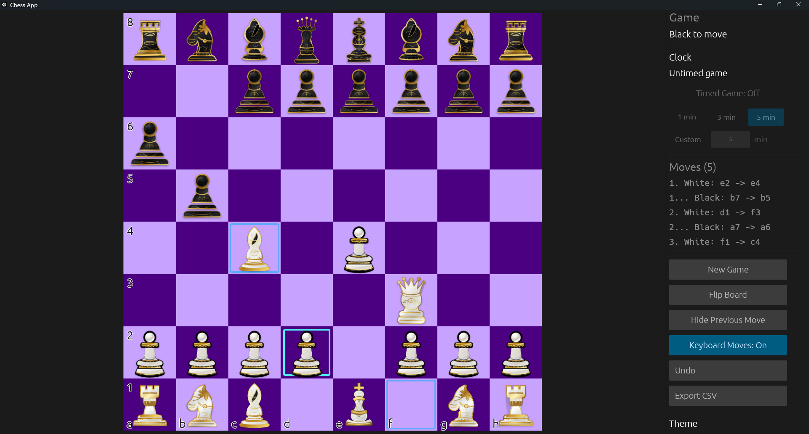

# Chess App

A native desktop chess app written in Rust. Two players, one keyboard, full standard rules, and a clean SVG board.



## Features

- **Full rule enforcement** powered by [`shakmaty`](https://crates.io/crates/shakmaty) — castling, en passant, promotion, check, checkmate, stalemate, insufficient material, the fifty-move rule, and threefold repetition.
- **Click-to-move and keyboard arrow interaction** for moving pieces, with selection highlights, dotted markers for legal quiet moves, and rings around capture targets.
- **Pawn promotion modal** for Queen / Rook / Bishop / Knight selection.
- **Board controls**: New Game, Flip Board, Undo, and a theme toggle (Brown / Gray / Tropical / Purple squares).
- **SAN move list** with move numbers, scrollable in the sidebar, and CSV export for sharing or analysis.
- **Last-move highlight** so you can always see where the opponent just moved.
- **Coordinate labels** on the board edges that flip with the orientation.
- **Single-binary distribution** — all SVG assets are embedded at compile time via `include_bytes!`. No asset directory to ship.
- **Native, immediate-mode UI** built on [`eframe`](https://crates.io/crates/eframe) + [`egui`](https://crates.io/crates/egui). Runs on Linux, macOS, and Windows.

## Build & run

Requirements: a recent stable Rust toolchain (1.75+ recommended).

```bash
git clone https://github.com/feenix100/rust_chess.git
cd rust_chess
cargo run --release
```

The release profile enables LTO and strips debug symbols, so the resulting binary is small and fast.

## Project structure

```
chess-app/
├── Cargo.toml
├── assets/
│   ├── pieces/   (12 SVGs — embedded at compile time)
│   └── squares/  (board square SVGs for each theme)
└── src/
    ├── main.rs        eframe entry point and window setup
    ├── app.rs         top-level UI loop, sidebar, control flow
    ├── board.rs       board widget — rendering + click hit-testing
    ├── game.rs        shakmaty wrapper, move history, SAN, draw tracking
    ├── assets.rs      embedded SVG bytes + rasterized texture cache
    └── promotion.rs   pawn promotion picker modal
```

Each module has a single responsibility:

- **`game.rs`** is the rules layer. It owns the `shakmaty::Chess` position, records moves with snapshots for undo, tracks repetition counts in a `HashMap` for threefold detection, and exposes a `GameOutcome` enum to the UI. It does not know anything about rendering or input.
- **`board.rs`** handles rendering, pointer hit-testing, and keyboard arrow navigation for moving pieces. SVGs are rasterized once per pixel size and cached. Click positions and keyboard-driven selections are converted back to `shakmaty::Square` values, accounting for board flipping.
- **`assets.rs`** embeds every SVG via `include_bytes!`, parses them with `usvg`, rasterizes with `resvg` + `tiny-skia`, and uploads the results as `egui` textures. Textures are cached by `(asset_key, size_px)` so window resizes only re-rasterize when the square size actually changes.
- **`promotion.rs`** is a small modal shown when a pawn reaches the last rank. It returns `Some(Role)` only on the frame the user clicks a button.
- **`app.rs`** ties everything together — selection state, keyboard input, theme toggle, undo, sidebar widgets — and runs the egui update loop.

## Tech stack

| Concern             | Crate                                                                                  |
| ------------------- | -------------------------------------------------------------------------------------- |
| GUI framework       | [`eframe`](https://crates.io/crates/eframe) + [`egui`](https://crates.io/crates/egui)  |
| Chess rules         | [`shakmaty`](https://crates.io/crates/shakmaty)                                        |
| SVG parsing         | [`usvg`](https://crates.io/crates/usvg)                                                |
| SVG rasterization   | [`resvg`](https://crates.io/crates/resvg) + [`tiny-skia`](https://crates.io/crates/tiny-skia) |
| Error handling      | [`anyhow`](https://crates.io/crates/anyhow)                                            |

## Roadmap

This is the player-vs-player baseline. Possible future additions:

- UCI engine integration so a human can play against [Rustic](https://github.com/mvanthoor/rustic), Stockfish, or any other UCI engine.
- PGN import / export.
- Move sound effects.
- Per-move time controls (clocks).

## License

[Choose a license — e.g., MIT or Apache-2.0 — and replace this line.]

## Asset attribution

[Replace with the source and license of the piece and square SVGs you ship in `assets/`.]
